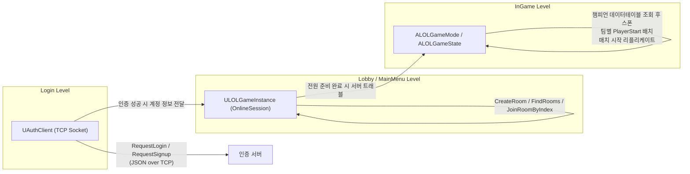

# MyLeagueOfLegends

언리얼 엔진 5로 제작 중인 **League of Legends 스타일 AOS(멀티플레이어 대전 액션) 게임**임.
로그인 → 로비(방 생성/참가) → 챔피언 선택 → 인게임(전투/아이템)까지 이어지는 멀티플레이어 게임의 전체 파이프라인을 C++ 코어 프레임워크와 블루프린트 게임플레이 레이어로 나누어 직접 설계·구현 중.

- **작업 기간**: 2026.04 ~ 진행 중
- **자세한 구현 배경 / 트러블슈팅**: [Portfolio_Notion.md](./Portfolio_Notion.md)

## Key Achievements

- **커스텀 인증 프로토콜**: 언리얼 OnlineSubsystem이 아닌 별도의 TCP 소켓 기반 인증 서버(JSON 프로토콜)를 직접 구현하고, 4바이트 빅엔디안 길이 프리픽스로 TCP 스트림의 메시지 경계 문제를 해결
- **서버 권위 기반 멀티플레이**: 스탯/스킬/전투/아이템 전 영역에서 `Replicated` 프로퍼티 + `Server RPC` 패턴을 일관되게 적용해 클라이언트 치팅을 방지하면서, 쿨타임은 Local Prediction으로 입력 반응성 확보
- **데이터 드리븐 설계**: 챔피언 스탯, 스킬, 아이템을 `DataTable`/`DataAsset`으로 분리해 기획 데이터와 로직을 분리, 콘텐츠 확장 시 코드 변경 최소화
- **C++ 코어 + 블루프린트 게임플레이 하이브리드 아키텍처**: 네트워킹·자료구조 등 성능/안정성이 중요한 부분은 C++로, 전투 연출·AI 비헤이비어 트리 등 반복 튜닝이 필요한 부분은 블루프린트로 구현

## 기술 스택

| 항목 | 내용 |
|---|---|
| 엔진 | Unreal Engine 5 |
| 언어 | C++17, Blueprint |
| 네트워킹 | UE Replication/RPC, OnlineSubsystem(세션 매치메이킹), Raw TCP Socket(인증) |
| 데이터 | DataTable, DataAsset, JSON |
| AI | AIController, Behavior Tree |
| UI | UMG (Widget Blueprint) |

## 게임 플로우 & 아키텍처

인증(TCP 소켓)과 매치메이킹(언리얼 OnlineSession)이 서로 다른 네트워킹 레이어로 분리되어 있는 점이 이 프로젝트의 특징임. 로그인으로 발급받은 계정 정보를 `ULOLGameInstance`가 세션 전 구간에서 들고 다니며 상태를 연결함.

### Why 인증과 매치메이킹을 분리했는가?

언리얼 OnlineSubsystem은 세션(방) 매치메이킹에는 적합하지만, 회원가입/로그인처럼 게임 세션과 무관한 계정 인증까지 여기에 태우면 인증 로직이 세션 생명주기에 종속됨. 계정 인증을 독립된 TCP 서버로 분리하면 이후 로비 채팅·챔피언 선택 채팅·친구 시스템처럼 세션과 무관하게 상시 연결이 필요한 기능도 같은 서버 위에 자연스럽게 확장할 수 있어, 장기적으로 더 유리하다고 판단함.

## 주요 시스템

### 스탯 시스템 (`StatComponent`)
`FChampionStatRow` 데이터테이블 기반으로 AD/AP/방어력/마방/HP/MP/이동속도/공격속도를 관리함. 모든 스탯이 `ReplicatedUsing`으로 동기화되며, 값이 바뀔 때마다 델리게이트(`OnADChanged`, `OnCurrentHPChanged` 등)를 브로드캐스트해 UI가 자동으로 갱신되도록 설계함. 아이템 장착/해제 시 `AddItemBonusStats`/`RemoveItemBonusStats`로 스탯을 가감.

### 전투 시스템 (C++ `SkillComponent` + Blueprint `BP_AttackerComponent`/`BP_HealthComponent`)
- **스킬**: Q/W/E/R + 패시브 슬롯을 `USkillDataAsset`으로 관리하고, 논타겟/타겟/대시형 3가지 실행 방식을 구분. `C2S_UseSkill` 서버 RPC로 검증 후 서버 시간 기준(`*_CooldownEndTime`)으로 쿨다운을 판정해 클라이언트-서버 시간차 문제를 방지. 실제 판정은 서버 권위로 처리하되, 쿨타임 UI는 클라이언트에서 먼저 낙관적으로 표시(Local Prediction)해 입력 반응성을 확보.
- **기본 공격**: `BP_AttackerComponent`가 챔피언과 미니언이 공유하는 공용 평타 컴포넌트로, `AttackType`(근접/원거리)에 따라 즉시 데미지 적용 또는 투사체 스폰으로 분기하며 `C2S_AttackDamage` 서버 RPC로 판정.
- **데미지 타입**: `BP_ApplyDamageType`을 부모로 Physical/Magic/True 세 서브클래스를 두고, `BP_HealthComponent::CalculateDamage`에서 물리/마법 저항을 각각 적용해 LoL의 3분류 데미지 체계(물리/마법/고정)를 재현. HP 자연 회복(`RegenerateHP`)과 사망 처리(`OnDeath` 델리게이트)까지 포함.
- **미니언 AI**: Behavior Tree(`BT_Minion`) + `BTT_AttackTarget` 태스크가 플레이어와 동일한 `BP_AttackerComponent`를 재사용해 공격 로직을 일원화.
- **네트워크 대역폭 절약**: 데미지처럼 결과에 영향을 주는 계산은 Reliable RPC로, 이펙트처럼 결과에 영향을 주지 않는 연출은 Unreliable로 전송해 구분.

### 아이템/인벤토리 시스템 (`ItemDataStructs` + `BP_InventoryComponent`)
아이템 데이터(가격/타입/스택 가능 여부/스탯 보너스)를 `FItemData`/`FItemStat` 구조체와 데이터테이블로 관리하고, `BP_InventoryComponent`가 슬롯 탐색(`FindSlot`)·스택 증감(`IncreaseSlotStack`)·추가/삭제를 처리하는 스택형 인벤토리 구조임. 상점 UI는 DataTable 추가만으로 아이템이 자동 반영되도록 Data-Driven하게 설계함.

### 투사체 시스템 (`ProjectileBase` → `HomingProjectile` / `NonTargetProjectile`)
Niagara 이펙트 + `ProjectileMovementComponent` 조합으로 유도탄/논타겟 투사체를 분리 구현, 데미지 값을 리플리케이트해 명중 판정의 서버 권위를 보장.

## 트러블슈팅 하이라이트

프로젝트 진행 중 마주친 문제와 해결 과정임. 자세한 원인 분석과 배운 점은 [Portfolio_Notion.md](./Portfolio_Notion.md)에 정리.

- **Tick 기반 공격 처리 구조 개선**: 공격 범위 체크와 공격 실행을 모두 Tick에서 처리하던 구조를, 거리 감지는 Tick·공격 실행은 `SetTimerByEvent` 기반 이벤트로 분리해 불필요한 프레임 단위 연산을 제거
- **챔피언 선택 PlayerState 폴링 최적화**: 네트워크 지연으로 생성 시점이 보장되지 않는 상대 PlayerState를 매 프레임 Tick에서 탐색하던 구조를, `FTimerManager` 기반 0.2초 간격 폴링 + 완료 시 타이머 해제 구조로 개선해 CPU 낭비 제거

## 맵 구성

`Login` → `MainMenu` / `Lobby` → `InGame` (Step01/Step02/Test는 레벨 프로토타이핑용)

## 진행 상황 & 회고

핵심 게임 루프(로그인 → 방 생성/참가 → 챔피언 선택 → 인게임 스폰 → 기본 전투)는 동작하는 상태이며, 현재는 아이템/전투 시스템을 다듬는 단계임. 개발 중 실제로 마주하고 해결해 나가는 이슈들도 기록해 둠.

- **데이터 구조 마이그레이션 진행 중**: 아이템 데이터 구조를 블루프린트 `ST_ItemData`/`ST_ItemStat`에서 C++ `FItemData`/`FItemStat`로 옮기는 리팩터링을 진행 중이며, 이 과정에서 `BP_InventoryComponent`의 데이터테이블 참조 노드가 신/구 구조체 불일치로 깨진 상태를 확인 — 데이터테이블을 신규 구조체(`DT_ItemDataes`)로 통일해 해결할 예정
- **네트워크 설정 분리 필요**: 인증 서버 IP가 현재 C++ 코드에 하드코딩되어 있어 Config 값으로 분리하는 작업 예정
- **데미지 인터페이스 정리**: `IDamageable` 인터페이스가 아직 빈 상태로, 향후 다양한 피격 대상(구조물/타워 등)에 대한 공통 처리 확장 예정
